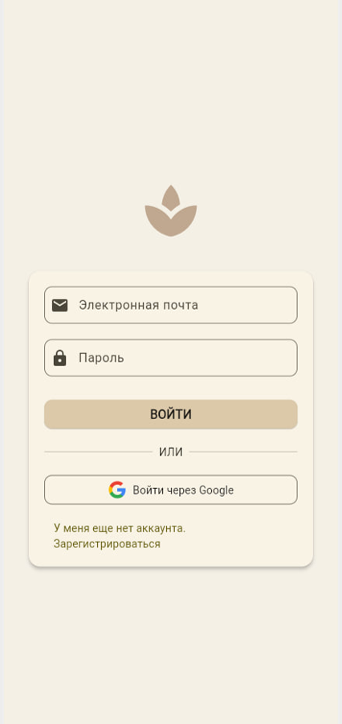
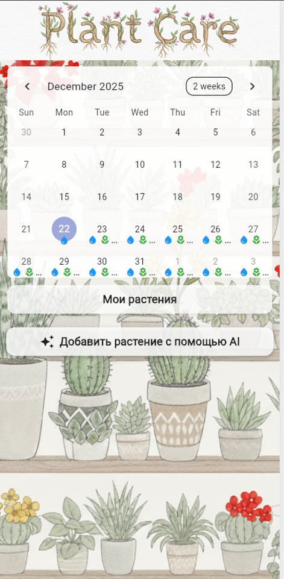
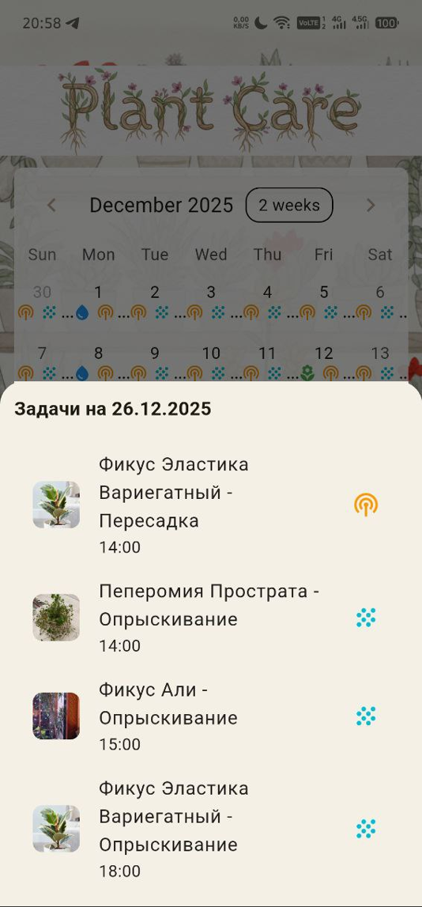
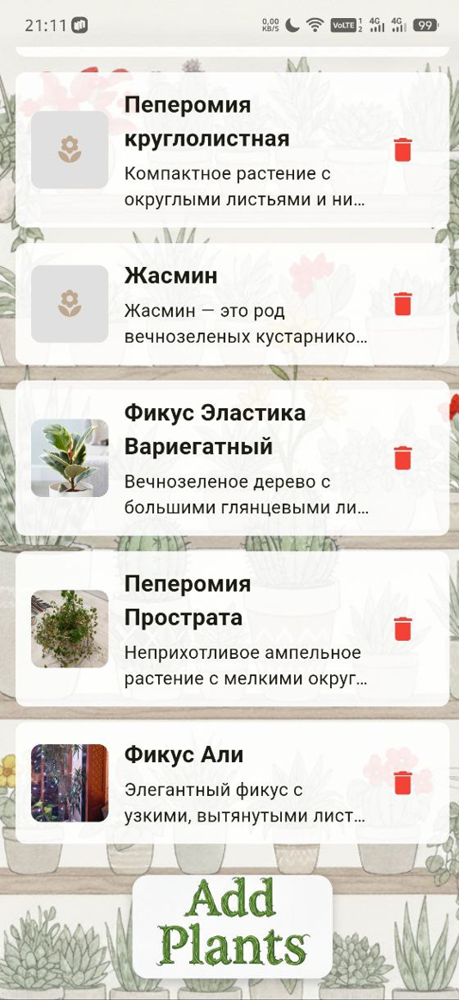
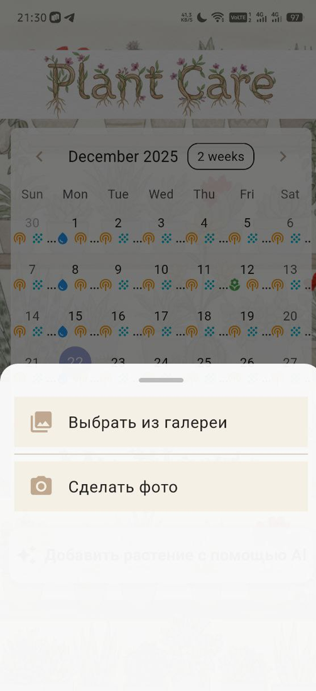
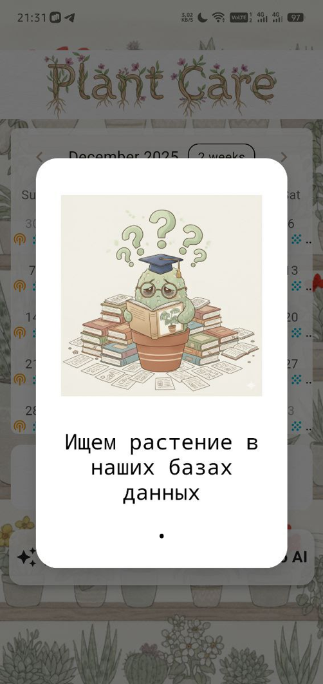
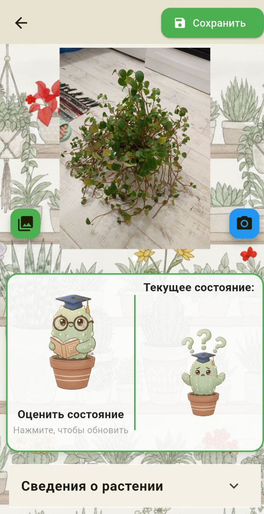
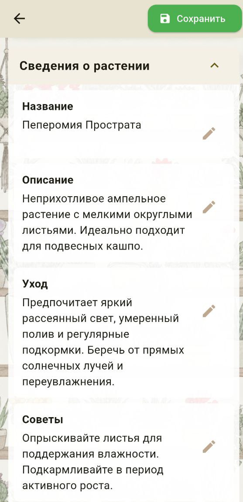
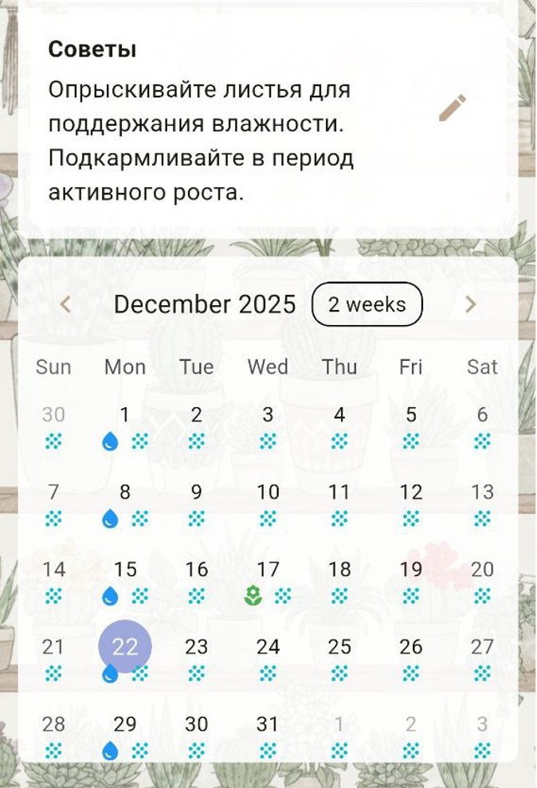

Flutter-приложение для ухода за растениями: распознавание по фото (AI), напоминания об уходе, синхронизация через Firebase.


<div align="center">
  
  
  
  
  
  
  
  
  
</div>

## Стек

- Flutter / Dart
- Firebase (Auth, Firestore, Storage, FCM)
- OpenRouter API (распознавание и оценка состояния растений)

## Настройка перед запуском

### 1. Firebase

```bash
# Скопируйте шаблоны и заполните из Firebase Console
copy lib\firebase_options.example.dart lib\firebase_options.dart
copy android\app\google-services.json.example android\app\google-services.json
copy ios\Runner\GoogleService-Info.plist.example ios\Runner\GoogleService-Info.plist
```

Или сгенерируйте конфиг через FlutterFire CLI:

```bash
dart pub global activate flutterfire_cli
flutterfire configure
```

### 2. OpenRouter API-ключ

Ключ **не хранится в репозитории**. Передайте его при запуске:

```bash
flutter run --dart-define=OPENROUTER_API_KEY=ваш_ключ
```

Для сборки release:

```bash
flutter build apk --dart-define=OPENROUTER_API_KEY=ваш_ключ
```

### 3. Зависимости

```bash
flutter pub get
```

## Запуск

```bash
flutter run --dart-define=OPENROUTER_API_KEY=ваш_ключ
```

## Примечание

Секреты (Firebase-конфиг и API-ключи) не включены в репозиторий.  
Для локального запуска скопируйте `.example`-файлы и передайте ключ OpenRouter через `--dart-define`.
